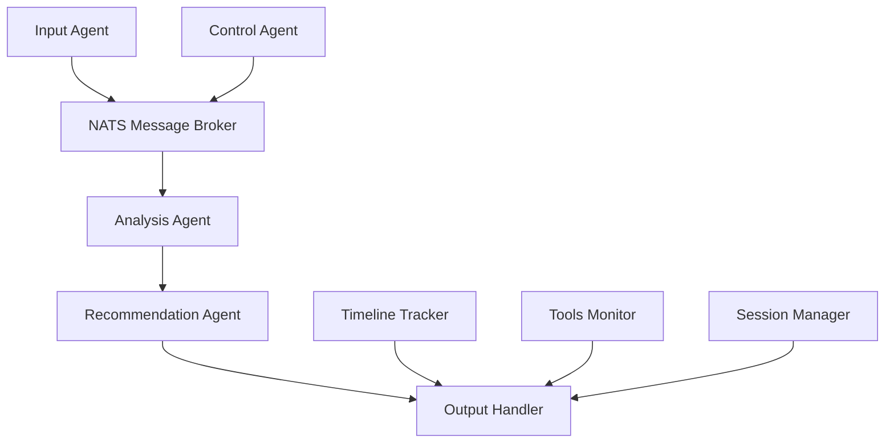

# Agent AI - Multi-Agent Cybersecurity Analysis System

## 🎯 Overview

Agent AI is an enhanced multi-agent cybersecurity analysis system that processes security alerts through a sophisticated pipeline of AI-powered agents. The system analyzes logs, maps them to the MITRE ATT&CK framework, and generates comprehensive incident response recommendations.

### Key Features

- **🔍 MITRE ATT&CK Analysis**: Automatic mapping of security events to MITRE ATT&CK techniques
- **📊 JSON Output Format**: Structured output compatible with security dashboards
- **⏱️ Timeline Tracking**: Real-time processing stage monitoring
- **🔧 Tools Monitoring**: Security tool status tracking
- **🗄️ Data Persistence**: Comprehensive logging and data retention
- **🚀 Ollama Integration**: Local LLM support for enhanced privacy
- **🎛️ Control API**: REST API for workflow orchestration
- **💾 Memory Management**: Automatic cleanup and session management

## 🏗️ Architecture



### Components

1. **Input Agent**: Processes raw security alerts and publishes to NATS
2. **Analysis Agent**: Maps alerts to MITRE ATT&CK framework using LLM
3. **Recommendation Agent**: Generates incident response recommendations
4. **Control Agent**: Orchestrates the entire workflow via REST API
5. **Output Handler**: Manages structured JSON output format
6. **Timeline Tracker**: Tracks processing stages and errors
7. **Tools Monitor**: Monitors security tool status
8. **Session Manager**: Manages memory and session lifecycle

## 🚀 Quick Start

### Prerequisites

- Python 3.11+
- NATS Server
- Ollama (for local LLM)

### Installation

1. **Clone and setup:**
```bash
cd agent_ai
pip install -r agntics_ai/requirements.txt
```

2. **Configure environment:**
```bash
cp .env.example .env
# Edit .env with your settings
```

3. **Start NATS server:**
```bash
docker run -p 4222:4222 -p 8222:8222 nats:latest -js
```

4. **Start Ollama and pull model:**
```bash
ollama pull qwen3:235b
```

### Running the System

#### Option 1: Full Pipeline (Recommended)
```bash
python run_demo.py
```

#### Option 2: Control Agent API
```bash
python start_control_agent.py
```
Then use the REST API at `http://localhost:9002`

#### Option 3: Individual Components
```bash
# Analysis Agent
python -m agntics_ai.agents.analysis_agent

# Recommendation Agent  
python -m agntics_ai.agents.recommendation_agent

# Input Agent
python -m agntics_ai.agents.input_agent
```

## 📋 Configuration

### Environment Variables (.env)
```bash
# Ollama LLM Configuration
LLM_MODEL=qwen3:235b
LLM_TEMPERATURE=0.05
LOCAL_LLM_URL=http://localhost:11434/api/generate
LLM_MAX_TOKENS=2048

# NATS Configuration
NATS_SERVER_URL=nats://localhost:4222
NATS_STREAM_NAME=AGENT_AI_PIPELINE

# Web App Configuration
WEBAPP_HOST=0.0.0.0
WEBAPP_PORT=5000

# Session Management
MAX_SESSIONS=1000
SESSION_TTL=86400
CLEANUP_INTERVAL=3600
```

### YAML Configuration (agntics_ai/config/config.yaml)
```yaml
# LLM Configuration (Ollama only)
llm:
  local_url: "http://localhost:11434/api/generate"
  local_model: "qwen3:235b"
  temperature: 0.05
  max_tokens: 2048

# NATS Configuration
nats:
  server_url: "nats://localhost:4222"
  stream_name: "AGENT_AI_PIPELINE"
  subjects:
    input: "agentAI.input"
    analysis: "agentAI.analysis"
    output: "agentAI.output"

webapp:
  host: "0.0.0.0"
  port: 5000
  debug: false

logging:
  level: "INFO"
  format: "%(asctime)s - %(name)s - %(levelname)s - %(message)s"
```

## 📊 Output Format

The system generates structured JSON output in `output.json`:

```json
{
  "agent.overview.updated": [{
    "id": "session-uuid",
    "data": {
      "description": "MITRE ATT&CK analysis completed"
    }
  }],
  "agent.tools.updated": [{
    "id": "session-uuid", 
    "data": [
      {"name": "Suricata IDS", "status": "active"},
      {"name": "OSQuery", "status": "inactive"},
      {"name": "YARA Scanner", "status": "missing"}
    ]
  }],
  "agent.recommendation.updated": [{
    "id": "session-uuid",
    "data": {
      "description": "Generated incident response recommendations",
      "content": "# Incident Report\n..."
    }
  }],
  "agent.checklist.updated": [{
    "id": "session-uuid",
    "data": {
      "title": "Incident Response Checklist",
      "content": "[ ] Isolate affected host\n[ ] Collect evidence\n..."
    }
  }],
  "agent.executive.updated": [{
    "id": "session-uuid",
    "data": {
      "title": "Security Incident Analysis - Execution",
      "content": "Detected PowerShell technique with 0.95 confidence score"
    }
  }],
  "agent.attack.updated": [{
    "id": "session-uuid",
    "data": [{
      "tacticID": "TA0002",
      "tacticName": "Execution", 
      "confidence": 0.95
    }]
  }],
  "agent.timeline.updated": [{
    "id": "session-uuid",
    "data": [
      {"stage": "Received Alert", "status": "success", "errorMessage": ""},
      {"stage": "Analysis Agent", "status": "success", "errorMessage": ""},
      {"stage": "Recommendation Agent", "status": "success", "errorMessage": ""}
    ]
  }]
}
```

## 🔧 Control Agent API

### Base URL: `http://localhost:9002`

### Workflow Endpoints

#### Start Processing Flow
```bash
POST /control/start
{
  "alert_id": "alert-001",
  "data": {
    "alert_name": "Suspicious PowerShell Activity",
    "severity": "High",
    "events": [...]
  }
}
```

#### Complete Type Classification
```bash
POST /control/type/finished
{
  "session_id": "session-uuid",
  "data": {
    "technique_id": "T1059.001",
    "technique_name": "PowerShell",
    "tactic": "Execution",
    "confidence_score": 0.95
  }
}
```

#### Complete Workflow
```bash
POST /control/flow/finished
{
  "session_id": "session-uuid", 
  "data": {
    "status": "success",
    "report": "# Incident Report\n...",
    "recommendations": [...]
  }
}
```

### Management Endpoints

- `GET /control/sessions` - List all sessions
- `GET /control/status/{session_id}` - Get session status
- `DELETE /control/session/{session_id}` - Delete session
- `GET /control/memory/stats` - Memory usage statistics
- `POST /control/memory/cleanup` - Manual cleanup
- `GET /control/health` - Health check

## 🔍 Monitoring & Management

### Memory Management
- **Automatic Cleanup**: Sessions older than 24 hours are automatically removed
- **Memory Limits**: Maximum 1000 active sessions in memory
- **Manual Cleanup**: Use `/control/memory/cleanup` endpoint

### Connection Management
- **Connection Pooling**: NATS connections are reused and managed centrally
- **Leak Prevention**: Automatic connection cleanup on shutdown

### Error Handling
- **Retry Logic**: LLM calls retry up to 3 times with exponential backoff
- **Timeline Tracking**: All errors are tracked in timeline with detailed messages
- **Graceful Degradation**: System continues operating even if some components fail

### Logging
```bash
# View logs
tail -f logs/agent_ai.log

# Debug level logging
LOG_LEVEL=DEBUG python run_demo.py
```

## 🐳 Docker Deployment

### Using Docker Compose
```bash
# Start all services
docker-compose up -d

# Start with Ollama
docker-compose --profile ollama up -d

# View logs
docker-compose logs -f agent-ai
```

### Manual Docker Build
```bash
docker build -t agent-ai .
docker run -p 9002:9002 -p 5000:5000 agent-ai
```

## 🧪 Testing

### Run Demo with Sample Data
```bash
python run_demo.py
```

### Test Individual Components
```bash
# Test Ollama connection
curl http://localhost:11434/api/generate -d '{"model":"qwen3:235b","prompt":"Hello","stream":false}'

# Test NATS connection
python -c "import asyncio; from agntics_ai.utils.nats_handler import NATSHandler; print('NATS OK')"

# Test Control Agent API
curl http://localhost:9002/control/health
```

### Load Testing
```bash
# Install artillery
npm install -g artillery

# Run load test
artillery run load-test.yml
```

## 🚨 Troubleshooting

### Common Issues

1. **NATS Connection Failed**
   - Check if NATS server is running: `docker ps | grep nats`
   - Verify connection string in config

2. **Ollama Model Not Found**
   - Pull the model: `ollama pull qwen3:235b`
   - Check available models: `ollama list`

3. **Memory Issues**
   - Monitor memory: `GET /control/memory/stats`
   - Trigger cleanup: `POST /control/memory/cleanup`

4. **Timeline Not Updating**
   - Check NATS subjects configuration
   - Verify agent connections

### Performance Tuning

1. **Increase LLM Timeout**
   ```python
   # In llm_handler_ollama.py
   timeout = aiohttp.ClientTimeout(total=60)  # Increase from 30
   ```

2. **Adjust Session Limits**
   ```bash
   # In .env
   MAX_SESSIONS=2000
   SESSION_TTL=172800  # 48 hours
   ```

3. **NATS Performance**
   ```bash
   # Start NATS with more memory
   docker run -p 4222:4222 nats:latest -js -m 8GB
   ```

## 📚 Development

### Project Structure
```
agent_ai/
├── agntics_ai/           # Main package
│   ├── agents/          # Agent implementations  
│   ├── config/          # Configuration management
│   ├── control/         # Control Agent (API)
│   ├── utils/           # Utilities and handlers
│   └── webapp/          # Web interface
├── database/            # Persistent data storage
├── run_demo.py          # Demo script
├── start_control_agent.py # Control Agent starter
└── README.md           # This file
```

### Adding New Agents
1. Create agent class in `agntics_ai/agents/`
2. Implement NATS message handling
3. Add to orchestrator in `cli/run_all.py`
4. Update timeline stages if needed

### Custom Output Formats
1. Modify `utils/output_handler.py`
2. Add new sections to output structure
3. Update agents to populate new sections

## 🤝 Contributing

1. Fork the repository
2. Create a feature branch
3. Add tests for new functionality
4. Ensure all tests pass
5. Submit a pull request

## 📄 License

MIT License - see LICENSE file for details

## 🆘 Support

- **Issues**: Report bugs via GitHub Issues
- **Documentation**: See `/docs` for detailed documentation
- **API Docs**: Available at `http://localhost:9002/docs` when Control Agent is running